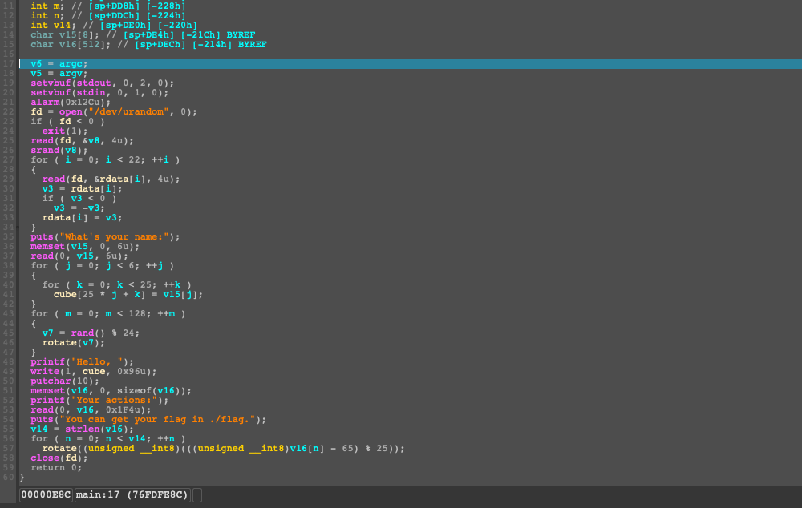
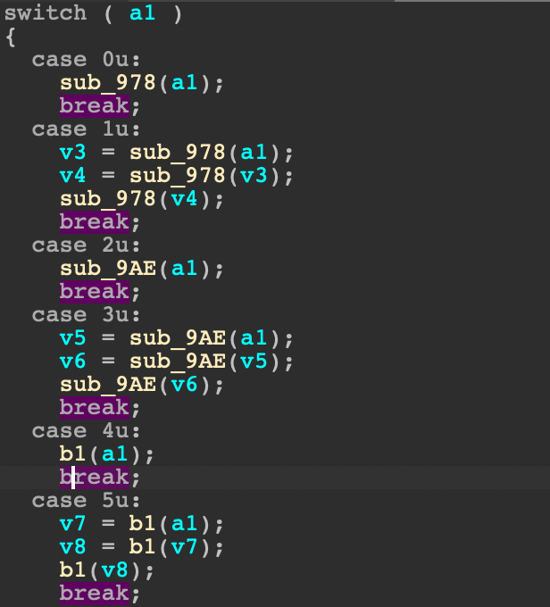
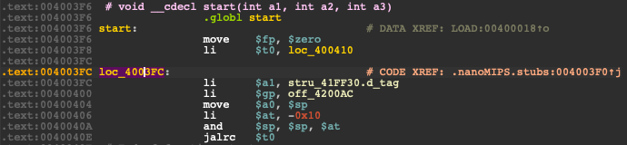

# nmips

IDA plugin to enable nanoMIPS processor support. This is not limited to simple disassembly, but fully supports decompilation and even fixes up the stack in certain functions using custom microcode optimizers.
It also supports relocations and automatic ELF detection (even though the UI might not show it, it kinda works).
Debugging also works thanks to GDB and it also does some other stuff, such as automatic switch detections.

Tested on IDA 7.6.

To see how well it works, with the mipscoder binary from 0CTF, see below :)
You can disassemble, decompile and even debug it!





## Installation

| OS | Download |
|----|----------|
|Linux| [Download](https://nightly.link/0rganizers/nmips/workflows/main/main/nmips_linux.zip)|
|macOS (ARM might be broken) | [Download](https://nightly.link/0rganizers/nmips/workflows/main/main/nmips_macos.zip)|
|Windows| [Download](https://nightly.link/0rganizers/nmips/workflows/main/main/nmips_windows.zip)|

Download the corresponding version for your OS and put the plugin inside `~/.idapro/plugins`.
Done! If you open a nanoMIPS ELF file, you should be able to just mash through some of the dialogs and get it working (yes metaPC should work fine if selected and yes it will show unknown arch, that's an IDA limitation unfortunately :/. Just keep mashing enter and you should be good ;)).

If you want to e.g. apply this to a flat binary file, you can instead just load it as a little endian MIPS file.
Then, select this plugin from `Edit > Plugins > nanoMIPS Processor Support`.
This will force it on, and it should start to disassemble stuff!

## Functionality

Currently, the following works:

- debugging
- creating relocations for libraries (e.g. libc) ``
- decompiling and disassembling (not all instructions are currently implemented)
- custom hexrays optimizer to fix stack variables being messed up
- automatic switch statement detection
- more stuff I probably forgot

**NOTE:** For debugging to work, you need to modify the gdb config file. Fortunately, this plugin can automatically do this for you. Unfortunately, due to a limitation of the gdb plugin, this will override the normal mips configuration. The plugin can automatically remove the changes again.
To automatically change the configuration, either use `Edit > Configure GDB for nanoMIPS` or `Ctrl+Shift+Meta+G`.

## Implementation

The basic idea behind the plugin is, to still load the binary with the MIPS processor module.
The plugin registers a bunch of plugin hooks, so that it can then give IDA the illusion of working on a "normal" MIPS binary. To that end, the binary translates any nanoMIPS instruction into the equivalent MIPS version, or - if it does not exist - implement it itself.

In case the instruction is translated to MIPS, it will be decompiled automatically without any issues (well that is if the operands are correctly set. Quite some instructions have a complex operand encoding inside IDA and don't work out of the box.).
Otherwise, decompiler hooks emit the correct hexrays microcode, so that these instructions can also be decompiled correctly.

If you are wondering how most of this was made possible, the answer is simple: A lot of reversing of IDA itself ;). Mostly the GDB and mips plugin, but also libida.

## Building

Make sure you have meson installed.
Then inside the `plugin` directory, just run:

```bash
meson setup builddir -Didasdk=$IDA_SDK -Dhexrays_sdk=$IDA_BIN/plugins/hexrays_sdk
meson compile -C builddir
```

## TODOs

- implement assembler -> actually not possible atm :/
- fix debugging to be nicer
- rework plugin to be nicer